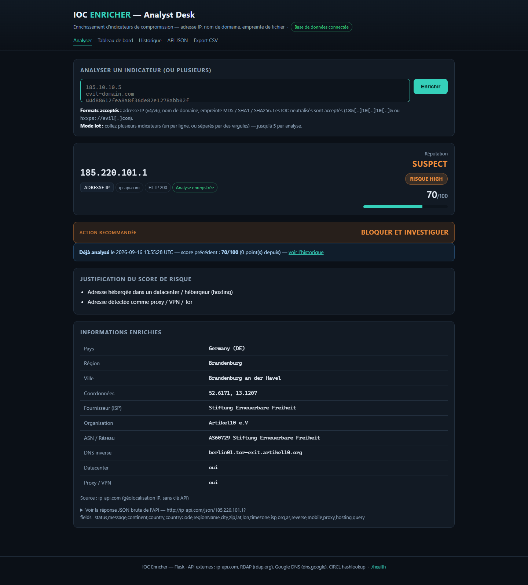

# 🛡️ IOC ENRICHER

**Cyber IOC Enricher** — application web Python.

Un analyste SOC y saisit un indicateur de compromission (IOC), obtient un
niveau de risque justifié calculé à partir d'API externes, et l'historique des
analyses est conservé dans une base de données PostgreSQL hébergée sur
**Supabase**.

> 🔗 **Application en ligne :** https://ioc-enricher-delta.vercel.app
> 📦 **Dépôt GitHub :** https://github.com/tad-code/ioc-enricher
> 📄 **Rapport de projet :** [`docs/Rapport-IOC-Enricher.pdf`](docs/Rapport-IOC-Enricher.pdf) (17 pages) — version Word modifiable : [`docs/Rapport-IOC-Enricher.docx`](docs/Rapport-IOC-Enricher.docx)
> 🎓 **Auteur :** Yannick Konan

---

## 1. Nom du projet

**IOC Enricher** — *Cyber IOC Enricher*.

Un **IOC** (*Indicator Of Compromise*) est un indice technique qui peut révéler
une compromission : une adresse IP malveillante, un nom de domaine suspect, ou
l'empreinte (hash) d'un fichier.

## 2. Problème résolu

Quand un analyste SOC reçoit un indicateur (`185.220.101.1`, `evil-corp.com`,
`44d88612fea8a8f36de82e1278abb02f`), il doit répondre en quelques secondes à
trois questions :

1. **Qu'est-ce que c'est ?** (quel type d'indicateur, à qui appartient-il ?)
2. **Est-ce dangereux ?** (quel niveau de risque, et pourquoi ?)
3. **Qu'en a-t-on déjà dit ?** (a-t-on déjà analysé cet indicateur ?)

Le faire à la main signifie ouvrir 3 ou 4 sites différents, comparer des
résultats et recopier les informations dans un tableur. **IOC Enricher
automatise cette tâche** : une seule saisie, un rapport structuré, un score de
risque justifié et un historique centralisé.

## 3. Fonctionnalités

| Fonctionnalité | Description |
|---|---|
| Détection automatique du type | L'utilisateur ne choisit rien : l'application reconnaît une IP, un domaine ou un hash. |
| Validation de la saisie | Les IOC mal formés sont refusés avec un message clair (jamais de `ERROR` brut). |
| Prise en charge des IOC neutralisés | `185[.]10[.]10[.]5` et `hxxps://evil[.]com` sont ré-acceptés automatiquement (*refang*). |
| Enrichissement par API externe | Interrogation d'une API publique selon le type d'IOC, réponse JSON exploitée. |
| Rapport structuré | Champs présentés en clair **+ réponse JSON brute** de l'API (dépliable). |
| Score de risque justifié | Score 0-100 converti en `LOW` / `MEDIUM` / `HIGH` / `CRITICAL`, avec la liste des raisons. |
| Persistance Supabase | Chaque analyse est enregistrée (IOC, type, score, source, JSON, date). |
| Historique | Les 25 dernières analyses sont affichées dans un tableau. |
| Suppression | Chaque ligne de l'historique peut être supprimée (bouton « Supprimer »). |
| Sonde de supervision | Route `/health` réduite au strict minimum (`{"status": "ok"}`), sans aucune information de configuration. |

## 4. Technologies utilisées

| Élément | Choix | Pourquoi |
|---|---|---|
| Langage | **Python 3.11** | Langage du sprint. |
| Interface web | **Flask 3** | Léger, adapté à un rendu serveur, déployable en *serverless*. |
| Requêtes HTTP | **requests** | Bibliothèque standard de fait pour appeler une API REST. |
| Base de données | **Supabase** (PostgreSQL) | Demandée par le sujet, avec API REST intégrée. |
| Configuration | **python-dotenv** + variables d'environnement | Aucune clé dans le code. |
| Tests | **pytest** | 14 tests unitaires automatisés. |
| Hébergement | **Vercel** | Déploiement public gratuit en une commande. |

## 5. API utilisées

### 5.1 Choix des sources

Une API différente par type d'IOC, **toutes gratuites et sans clé obligatoire** :

| Type d'IOC | API | Données récupérées |
|---|---|---|
| Adresse IP | `ip-api.com` | Pays, ville, FAI, organisation, ASN, datacenter, proxy/VPN/Tor |
| *(option)* IP | `AbuseIPDB` | Score d'abus communautaire, nombre de signalements |
| Nom de domaine | `rdap.org` (RDAP) | Registrar, dates de création/expiration, statut, serveurs de noms |
| Empreinte | `hashlookup.circl.lu` | Nom de fichier, éditeur, indice de confiance (base CIRCL) |

### 5.2 Exemple détaillé — `ip-api.com`

| Élément | Valeur |
|---|---|
| **Méthode** | `GET` |
| **Endpoint** | `http://ip-api.com/json/185.220.101.1` |
| **Paramètres** | `fields=status,country,countryCode,regionName,city,isp,org,as,proxy,hosting,query` |
| **En-têtes envoyés** | `User-Agent: IOC-Enricher/1.0`, `Accept: application/json` |
| **Clé API** | aucune (offre gratuite, limite 45 requêtes/minute) |
| **Code de réponse attendu** | `200 OK` |

Extrait de la réponse JSON reçue :

```json
{
  "status": "success",
  "country": "Germany",
  "countryCode": "DE",
  "city": "Berlin",
  "isp": "Stiftung Erneuerbare Freiheit",
  "org": "Tor Exit Node",
  "as": "AS205100 F3 Netze e.V.",
  "proxy": true,
  "hosting": true,
  "query": "185.220.101.1"
}
```

Ce que Python en fait :

```python
reponse = requests.get(url, headers=HEADERS, params=params, timeout=8)  # 1. appel HTTP
if reponse.status_code >= 400:                                          # 2. code de statut
    raise EnrichmentError(f"HTTP {reponse.status_code}", kind="http")
brut = reponse.json()                                                   # 3. JSON -> dictionnaire Python
if brut.get("proxy"):                                                   # 4. exploitation
    signaux.append({"points": 35, "label": "Adresse détectée comme proxy / VPN / Tor"})
```

### 5.3 Codes de statut HTTP gérés

| Code | Situation | Comportement de l'application |
|---|---|---|
| `200` | Réponse normale | Les données sont affichées et enregistrées. |
| `401` | Clé API refusée (AbuseIPDB) | Message explicite + repli sur ip-api.com. |
| `404` | Domaine ou hash inconnu du registre | Traité comme **signal de risque** (et non comme une erreur). |
| `429` | Quota dépassé | Message « quota atteint, réessayez dans une minute ». |
| `5xx` | Panne du fournisseur | Message « API injoignable », l'application reste utilisable. |

## 6. Installation

```bash
# 1. Récupérer le projet
git clone https://github.com/tad-code/ioc-enricher.git
cd ioc-enricher

# 2. Créer un environnement virtuel Python
python -m venv .venv
.venv\Scripts\activate          # Windows
# source .venv/bin/activate     # macOS / Linux

# 3. Installer les dépendances
pip install -r requirements.txt

# 4. Configurer les variables d'environnement (voir section 7)
copy .env.example .env          # Windows
# cp .env.example .env          # macOS / Linux

# 5. Créer la table dans Supabase
#    Supabase > SQL Editor > coller le contenu de sql/schema.sql > Run

# 6. Lancer l'application
python app.py
# -> http://127.0.0.1:5000
```

## 7. Variables d'environnement

Le fichier `.env` (jamais publié sur GitHub, il est listé dans `.gitignore`) :

| Variable | Obligatoire | Rôle |
|---|---|---|
| `SUPABASE_URL` | ✅ | Adresse de l'API REST du projet Supabase (`https://xxxx.supabase.co`). |
| `SUPABASE_SECRET_KEY` | ✅ recommandé | Clé **secrète**, utilisée uniquement côté serveur (jamais envoyée au navigateur). Elle contourne les règles RLS : la table peut donc rester totalement fermée au public. |
| `SUPABASE_ANON_KEY` | ⚠️ secours | Clé publique, à utiliser seulement si vous n'avez pas de clé secrète. La table doit alors avoir des politiques RLS ouvertes (« mode dégradé » commenté dans `sql/schema.sql`). |
| `ABUSEIPDB_API_KEY` | ❌ | Si renseignée, remplace `ip-api.com` pour la réputation des IP. |
| `FLASK_SECRET_KEY` | ❌ | Clé secrète Flask. |

> ⚠️ **Aucune clé n'est écrite dans le code.** En local elles viennent du
> fichier `.env` ; en production elles viennent des *Environment Variables*
> du tableau de bord Vercel (Project → Settings → Environment Variables).

## 8. Architecture

```
                    UTILISATEUR
                         │  saisit un IOC dans le formulaire
                         ▼
                 INTERFACE WEB  (templates/index.html)
                         │  POST /analyze
                         ▼
                APPLICATION PYTHON  (app.py — Flask)
                         │
        ┌────────────────┼────────────────┬───────────────────┐
        ▼                ▼                ▼                   ▼
  ioc_parser.py    enrichment.py     scoring.py            db.py
  quel type        API externe       score de risque       Supabase
  d'IOC ?          (JSON)            justifié              (REST)
                         │                │                   │
                         ▼                ▼                   ▼
                  ip-api.com         0 → 100           table ioc_analyses
                  rdap.org           LOW→CRITICAL      (PostgreSQL)
                  hashlookup
                         │
                         ▼
             RÉSULTAT AFFICHÉ À L'UTILISATEUR
        (rapport + JSON brut + historique + bouton supprimer)
```

### Rôle de chaque fichier

| Fichier | Rôle |
|---|---|
| `app.py` | Application Flask : routes, enchaînement des étapes, gestion des erreurs. |
| `ioc_parser.py` | Détection et validation du type d'IOC (aucun appel réseau). |
| `enrichment.py` | Appels HTTP aux API externes + normalisation des réponses JSON. |
| `scoring.py` | Règles de risque : signaux → score 0-100 → niveau LOW/…/CRITICAL. |
| `db.py` | Accès Supabase (API REST PostgREST) : insert, select, delete, count. |
| `templates/index.html` | Interface web (formulaire, rapport, historique). |
| `api/index.py` | Point d'entrée pour le déploiement serverless sur Vercel. |
| `sql/schema.sql` | Création de la table `ioc_analyses` et des règles d'accès (RLS). |
| `tests/test_socle.py` | Tests unitaires (pytest). |
| `tools/smoke_api.py` | Test des API externes en conditions réelles. |

### Schéma de la table Supabase

| Colonne | Type | Description |
|---|---|---|
| `id` | `bigint` (identité) | Clé primaire. |
| `ioc` | `text` | L'indicateur analysé. |
| `ioc_type` | `text` | `ip`, `domain` ou `hash`. |
| `risk_level` | `text` | `LOW`, `MEDIUM`, `HIGH` ou `CRITICAL`. |
| `risk_score` | `integer` | Score de 0 à 100. |
| `source_api` | `text` | API qui a fourni l'enrichissement. |
| `summary` | `jsonb` | Champs enrichis + endpoint appelé. |
| `reasons` | `jsonb` | Liste des raisons du score. |
| `created_at` | `timestamptz` | Date de l'analyse (par défaut `now()`). |

## 9. Captures d'écran

| Écran | Fichier |
|---|---|
| Formulaire de saisie et historique | [`docs/capture-accueil.png`](docs/capture-accueil.png) |
| Rapport d'analyse d'une IP (score HIGH) | [`docs/capture-rapport.png`](docs/capture-rapport.png) |
| Réponse JSON brute de l'API (dépliée) | [`docs/capture-json.png`](docs/capture-json.png) |
| Analyse d'un nom de domaine | [`docs/capture-domaine.png`](docs/capture-domaine.png) |



## 10. URL de démonstration

# 🔗 https://ioc-enricher-delta.vercel.app

L'application est **publiquement accessible** : le formateur peut l'ouvrir sans
rien installer. Testée en ligne : page d'accueil, analyse d'IP / domaine / hash,
enregistrement dans Supabase, historique, suppression, cas d'erreur.

Déploiement réalisé avec la CLI Vercel :

```bash
vercel link --project ioc-enricher
vercel env add SUPABASE_URL production        # variables saisies hors du code
vercel env add SUPABASE_ANON_KEY production
vercel --prod
```

| Élément | Valeur |
|---|---|
| Hébergeur | Vercel (offre gratuite) |
| Projet | `ioc-enricher` |
| Type d'exécution | Fonction Python *serverless* (`api/index.py`, `maxDuration: 30s`) |
| Variables d'environnement | `SUPABASE_URL`, `SUPABASE_SECRET_KEY` (Production) |
| Protection d'accès | préversions protégées, production publique (accès libre voulu pour l'évaluation) |
| Sonde | https://ioc-enricher-delta.vercel.app/health |

---

## 🧪 Tests réalisés

### Tests unitaires

```bash
python -m pytest -v
# 14 passed
```

Ils couvrent : la détection du type d'IOC, le *refang*, la saisie vide, la
saisie invalide, la normalisation (`www.`, casse), les fourchettes de score et
le bornage 0-100.

### Test des API en conditions réelles

```bash
python tools/smoke_api.py
```

Résultat obtenu le 16/09/2026 :

```
[OK]   8.8.8.8                              ip-api.com        HTTP 200  -> MEDIUM (35/100)
[OK]   185.220.101.1                        ip-api.com        HTTP 200  -> HIGH (70/100)
[OK]   github.com                           RDAP (rdap.org)   HTTP 200  -> LOW (0/100)
[OK]   ce-domaine-nexiste-pas-1234567890.com RDAP (rdap.org)  HTTP 404  -> HIGH (55/100)
[OK]   44d88612fea8a8f36de82e1278abb02f     CIRCL hashlookup  HTTP 200  -> LOW (0/100)
[OK]   00000000000000000000000000000000     CIRCL hashlookup  HTTP 404  -> MEDIUM (30/100)
6/6 cas traités avec succès.
```

### Test de l'application déployée (bout en bout)

Après déploiement, l'application publique a été testée automatiquement par script
(appels HTTP réels sur l'URL de production) : **19 vérifications, 19 réussies**.

| Vérification | Résultat |
|---|---|
| Page d'accueil servie par Flask | ✅ HTTP 200, interface complète |
| Sonde `/health` | ✅ HTTP 200 — `{"status": "ok", "service": "ioc-enricher"}` |
| Analyse d'une IP → rapport affiché | ✅ score HIGH (70/100) |
| Réponse JSON brute affichée | ✅ |
| Ligne réellement écrite dans Supabase | ✅ (vérifiée par une requête REST indépendante) |
| Analyse d'un domaine et d'un hash | ✅ HTTP 200 |
| Saisie invalide / saisie vide | ✅ HTTP 400 + message explicite |
| Erreur API (IP privée) | ✅ HTTP 502 + « private range », pas de trace Python |
| Page inconnue | ✅ HTTP 404 personnalisée |
| Suppression d'une analyse | ✅ ligne absente de la base après suppression |

### Les 6 cas exigés par le sujet

| Cas | Comment le tester | Résultat attendu |
|---|---|---|
| **Cas normal** | Saisir `8.8.8.8` | Rapport complet + enregistrement dans Supabase. |
| **Cas invalide** | Saisir `ceci n'est pas un ioc !` | Message « n'est pas un IOC valide » (HTTP 400), page intacte. |
| **Cas vide** | Cliquer sur *Enrichir* sans rien saisir | Message « Aucune valeur saisie » (HTTP 400). |
| **Erreur API** | Tester `192.168.1.10` (IP privée) | « ip-api.com a refusé l'adresse : private range » — pas de trace Python. |
| **Erreur réseau** | Couper Internet puis analyser | « Connexion impossible à l'API externe » — l'application reste utilisable. |
| **Erreur Supabase** | Vider `SUPABASE_URL` dans `.env` puis analyser | Le rapport s'affiche, avec le bandeau « Analyse effectuée, mais NON enregistrée dans l'historique ». |

## 🔒 Sécurité

Le projet a été passé en revue sur ses trois briques : dépendances, base de
données et hébergement.

| Faille / risque identifié | Correction apportée |
|---|---|
| La table Supabase était ouverte en lecture, en insertion **et en suppression** au rôle public : quiconque possédait la clé publique pouvait vider la base | L'application utilise désormais une **clé secrète côté serveur**, et `sql/schema.sql` **supprime** les politiques RLS ouvertes : l'API REST publique ne renvoie alors plus rien. *(Étape finale : ajouter `SUPABASE_SECRET_KEY` puis ré-exécuter `sql/schema.sql`.)* |
| `requests` **2.32.3** vulnérable (CVE-2024-47081 : fuite des identifiants `netrc`) | Mise à jour vers `requests==2.34.2` |
| Flask **3.0.3** et python-dotenv **1.0.1** anciens | Mise à jour vers Flask 3.1.3 (Werkzeug 3.1.8) et python-dotenv 1.2.3 |
| Aucun en-tête de sécurité HTTP | HSTS, `X-Content-Type-Options`, `X-Frame-Options: DENY`, `Referrer-Policy`, `Permissions-Policy`, `Cross-Origin-Opener-Policy`, `X-Robots-Tag` et **CSP restrictive** (`vercel.json`) |
| La préversion Vercel était publiquement accessible | Protection d'accès réactivée **pour les préversions uniquement** : seule la production est publique |
| `/health` exposait la configuration et le nombre de lignes en base | Réduite à `{"status": "ok", "service": "ioc-enricher"}` |
| Saisie non bornée (consommation CPU sur une chaîne très longue) | Saisie limitée à 512 caractères ; corps de requête limité à 16 Ko (erreur `413` gérée proprement) |
| JavaScript en ligne (`onsubmit=`), incompatible avec une CSP stricte | Déplacé dans `static/app.js` |
| Alertes de sécurité GitHub désactivées | Dependabot (alertes **et** mises à jour), analyse des secrets et `push protection` activés ; fichier `SECURITY.md` ajouté |

Aucune clé n'est présente dans le dépôt : vérifié dans les fichiers suivis **et**
dans tout l'historique Git (`git log -S`). Les identifiants vivent uniquement
dans `.env` en local et dans les *Environment Variables* de Vercel.

```bash
# État de la sécurité du dépôt
gh api repos/tad-code/ioc-enricher --jq .security_and_analysis
```

## 🎤 Préparation de la soutenance

> 📘 **Mémo complet à lire avant l'oral : [`docs/GUIDE-SOUTENANCE.md`](docs/GUIDE-SOUTENANCE.md)**
> — le pitch de 60 secondes, les 5 parties de la soutenance, les 4 « tests
> surprise » les plus probables (avec les modifications de code à faire en
> direct) et 10 questions/réponses rapides.

**Qu'est-ce qu'une requête HTTP ?**
C'est un message envoyé par un client (ici Python, avec `requests`) à un serveur
web pour lui demander une ressource. Elle contient une **méthode** (`GET` pour
lire, `POST` pour créer, `DELETE` pour supprimer), une **URL**, des **en-têtes**
(dont l'authentification) et parfois un **corps** (les données, en JSON). Le
serveur répond avec un **code de statut** (200 = succès, 404 = absent, 429 =
quota dépassé) et un **corps de réponse**.

**Qu'est-ce que du JSON ?**
*JavaScript Object Notation* : un format texte universel pour échanger des
données structurées, sous forme de couples clé/valeur et de listes. Python le
transforme en `dict` et en `list` avec `reponse.json()`. C'est le format utilisé
par les trois API du projet **et** par Supabase.

**Comment les données arrivent-elles dans Python ?**
`requests.get(...)` renvoie un objet `Response`. `reponse.json()` lit le corps
de la réponse et le convertit en dictionnaire Python. On lit ensuite les clés
avec `brut.get("country")`, `brut.get("proxy")`, etc.

**Comment les données partent-elles vers Supabase ?**
Supabase expose chaque table via une API REST. On envoie donc une requête
`POST` vers `https://<projet>.supabase.co/rest/v1/ioc_analyses` avec la clé
`anon` dans les en-têtes `apikey` et `Authorization: Bearer`, et un **corps
JSON** contenant la ligne à insérer. L'en-tête `Prefer: return=representation`
demande à Supabase de renvoyer la ligne créée (avec son `id` et sa date).

**Pourquoi une base de données ?**
Pour ne pas perdre le travail : garder la trace des analyses, savoir si un IOC
a déjà été vu, et permettre la suppression d'une entrée obsolète.

**Comment l'application est-elle déployée ?**
Le code est publié sur GitHub, puis déployé sur Vercel (`vercel --prod`).
Vercel exécute `api/index.py`, qui importe l'application Flask. Les variables
d'environnement sont saisies dans le tableau de bord Vercel : elles ne sont donc
jamais dans le dépôt.

---

## 📄 Licence

Projet pédagogique — enrichissement d'indicateurs de compromission.
